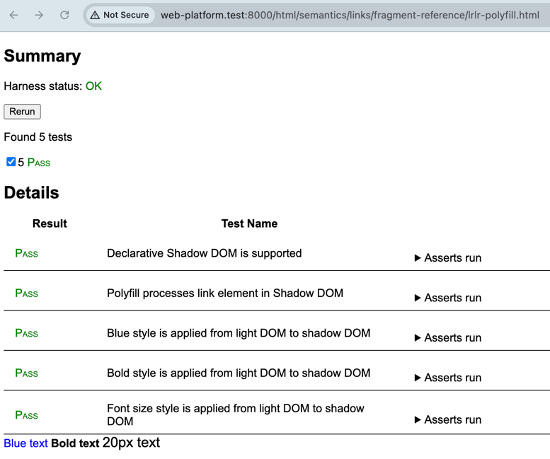
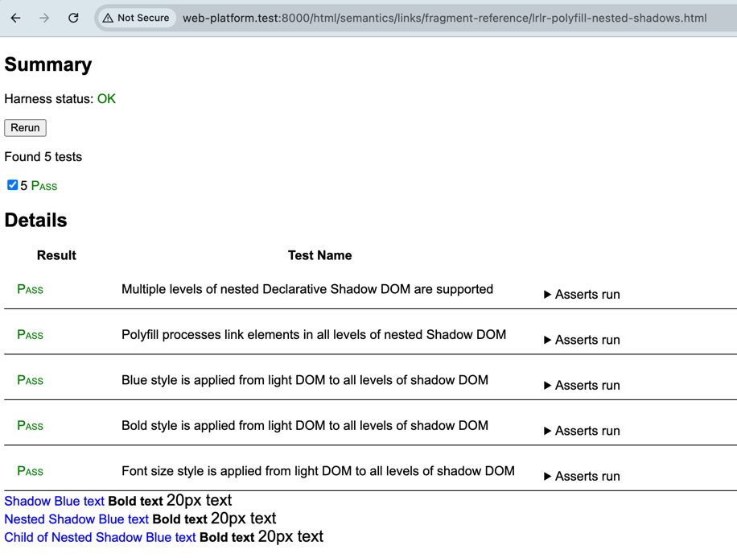
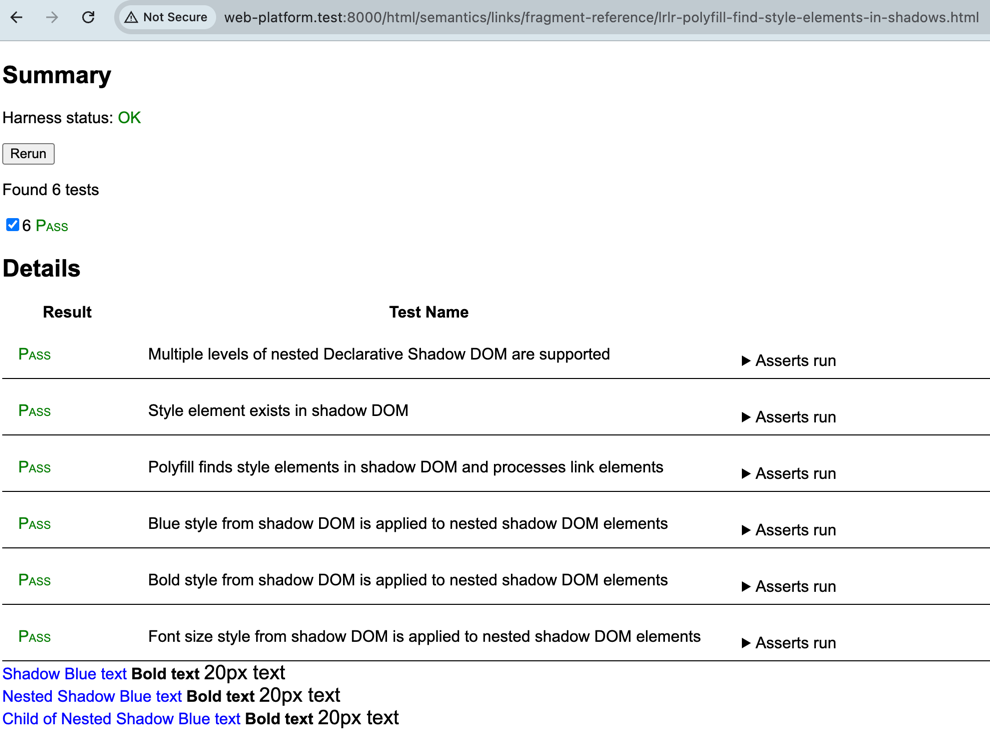

# Link to Style Elements

See [whatwg issue #11019](https://github.com/whatwg/html/issues/11019).

With Chrome [intent to prototype](https://groups.google.com/a/chromium.org/g/blink-dev/c/676KIre8ZZY/m/pojeIaOvDwAJ) `<link>` fragment identifier references to inline `<style>` tags, [here are wpt tests](https://github.com/htmlcomponents/link-to-style-elements) for variants of the [lrlr-polyfill](https://github.com/KurtCattiSchmidt/kurtspublishedw3cdrafts) ("Link Rel Local Reference") in the corresponding HTLML spec [pull request](https://github.com/whatwg/html/pull/11212).

**lrlr-polyfill** wpt updates the polyfill to correctly handle multiple style rules.




**lrlr-polyfill-nested-shadows** wpt updates the polyfill to handle nested shadows.



**lrlr-polyfill-find-style-elements-in-shadows** wpt updates the polyfill to find style elements both in light DOM and in shadow DOMs, to potentially address if ultimately desireable the [streaming ssr](https://github.com/whatwg/html/issues/11019#issuecomment-2803094708) use case [discussed here](https://github.com/whatwg/html/issues/11019#issuecomment-2828783170).



Also, the example streaming-server.js shows using the polyfill in the streaming SSR use case, i.e. in contrast to classic ssr, using HTTP Transfer-Encoding: chunked to streaming-emit shadow components without prior knowledge of the styles to be used in them.

## Running the wpt tests

Follow the [instructions](https://web-platform-tests.org/running-tests/index.html) for installing and running Web Platform Tests tests on your local machine.

Copy the folder "fragment-reference" into an appropriate location in your local wpt test directory. I used wpt/html/semantics/links/fragment-reference.

## Running the streaming-server.js example

In a terminal:

```bash
node streaming-server.js
```

In a web browser, navigate to:

```text
http://localhost:8080
```

