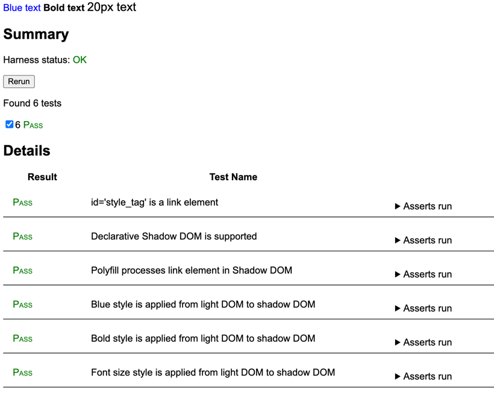

# Link to Style Elements

See [whatwg issue #11019](https://github.com/whatwg/html/issues/11019).

With Chrome [intent to prototype](https://groups.google.com/a/chromium.org/g/blink-dev/c/676KIre8ZZY/m/pojeIaOvDwAJ) `<link>` fragment identifier references to inline `<style>` tags, [here are wpt tests](https://github.com/htmlcomponents/link-to-style-elements) for variants of the [lrlr-polyfill](https://github.com/KurtCattiSchmidt/kurtspublishedw3cdrafts) ("Link Rel Local Reference") in the corresponding HTLML spec [pull request](https://github.com/whatwg/html/pull/11212).

## lrlr-polyfill

**lrlr-polyfill** wpt updates the polyfill to correctly handle multiple style rules.


## lrlr-polyfill-nested-shadow

**lrlr-polyfill-nested-shadows** wpt updates the polyfill to handle nested shadows.


## lrlr-polyfill-find-style-elements-in-shadows

**lrlr-polyfill-find-style-elements-in-shadows** wpt updates the polyfill to find style elements both in light DOM and in shadow DOMs, to potentially address if ultimately desireable the [streaming ssr](https://github.com/whatwg/html/issues/11019#issuecomment-2803094708) use case [discussed here](https://github.com/whatwg/html/issues/11019#issuecomment-2828783170).


## lrlr-polyfill-link-to-link

Considering the WHATNOT [discussion in #11233](https://github.com/whatwg/html/issues/11233) about links to links:

>Luke: I remember we discussed before; might want to link to other <link> element, do not just inline.

>Kurt: Can't do that now, but open to adding that. But what situation does it help with? Conceptually makes sense, but if style tag is in scope too, does that unlock new scenarios? Maybe if media elements don't match?

>Luke: In my head, maybe perf stuff, but maybe that's not the case?

**lrlr-polyfill-link-to-link** wpt [here](https://github.com/htmlcomponents/link-to-style-elements) updates the polyfill to use as a resource a link element in addition to  a style element.



The benefit of also supporting a link reference to a link element in addition to a style element is that the styles can be loaded from a network resource in addition to a style element, while eliminating the FOUC caused by [unspecified](https://github.com/whatwg/html/issues/11244) and [unreliable](https://issues.chromium.org/issues/383593251) cache behavior and the duplicated instances that result from multiple link elements all pointing to the same network resource.

For example:

styles.css:
```css
.test-blue {
    color: blue;
}
```

lrlr-polyfill-link-to-link.html:
```html
<head>
   <link rel="stylesheet" href="styles.css" id="style_tag" />
</head>
<body>
<div>
    <template shadowrootmode="open">
        <link rel="stylesheet" href="#style_tag" />
        <span class="test-blue">Blue text</span>
    </template>
</div>
```

## Streaming SSR Use Case Example

Also, the example streaming-server.js shows using the polyfill in the streaming SSR use case, i.e. in contrast to classic ssr, using HTTP Transfer-Encoding: chunked to streaming-emit shadow components without prior knowledge of the styles to be used in them.

## Running the wpt tests

Follow the [instructions](https://web-platform-tests.org/running-tests/index.html) for installing and running Web Platform Tests tests on your local machine.

Copy the folder "fragment-reference" into an appropriate location in your local wpt test directory. I used wpt/html/semantics/links/fragment-reference.

## Running the streaming-server.js example

In a terminal:

```bash
node streaming-server.js
```

In a web browser, navigate to:

```text
http://localhost:8080
```

